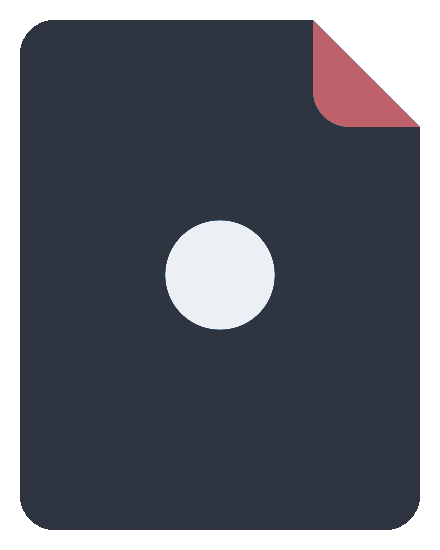
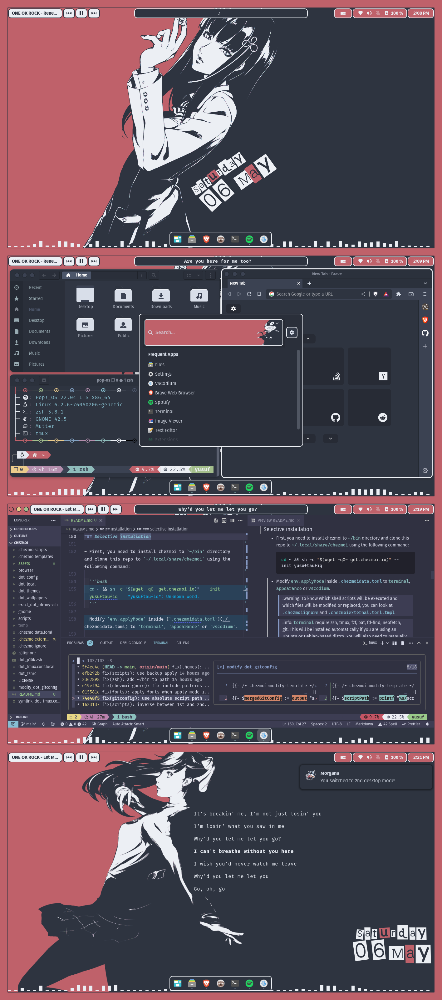

<div align="center">
  <p><a href="https://github.com/yusuftaufiq/dotfiles"></a></p>
  <h1>~/.dotfiles</h1>
  <p>My personal dotfiles collection for configuring GNOME, conky, git, zsh, tmux, VS Codium, and other stuff with Persona 5 x Nord Theme managed via chezmoi.</p>
  <p>
    <a href="https://wiki.gnome.org/">
      
    </a>
    <a href="https://www.nordtheme.com/">
      
    </a>
    <a href="https://github.com/yusuftaufiq/dotfiles">
      
    </a>
    <a href="https://github.com/yusuftaufiq/dotfiles/blob/main/README.md">
      
    </a>
  </p>
</div>

## Table of Contents

- [Overview](#overview)
- [What's in it?](#whats-in-it)
- [Installation](#installation)
- [Usage](#usage)
- [Bash aliases](#bash-aliases)
- [Keybindings](#keybindings)
- [Credits](#credits)

## Overview

<details>
  <summary>Click here to see some screenshots</summary>



</details>

## What's in it?

- Dotfiles management via chezmoi, configured to:
  - Running [scripts](./.chezmoiscripts/) pre and post-install.
  - Use dependencies from [external sources](./.chezmoiexternal.toml.tmpl) to keep the content synchronized with the latest updates.
  - Templating to change file content depending on the environment. E.g.: [modify_settings.json](./dot_config/VSCodium/User/modify_settings.json) to combine the existing and new `settings.json`.
- GNOME configurations for:

  - GNOME extensions

    - [Aylur's Widgets](https://extensions.gnome.org/extension/5338/aylurs-widgets/)
    - [Rounded Window Corners](https://extensions.gnome.org/extension/5237/rounded-window-corners/)
    - [Unite](https://extensions.gnome.org/extension/1287/unite/)
    - [Dash to Dock for COSMIC](https://extensions.gnome.org/extension/5004/dash-to-dock-for-cosmic/)
    - [Compiz Alike Magic Lamp Effect](https://extensions.gnome.org/extension/3740/compiz-alike-magic-lamp-effect/)
    - [ArcMenu](https://extensions.gnome.org/extension/3628/arcmenu/)
    - [Executor](https://extensions.gnome.org/extension/2932/executor/)
    - [Frippery Move Clock](https://extensions.gnome.org/extension/2/move-clock/) - <sub><sup>Optional to install, alternative to moving the clock position to the right if not using Pop Cosmic</sup></sub>
    - [Pop Shell](https://github.com/pop-os/shell) - <sub><sup>Optional to install</sup></sub>
    - [Pop Cosmic](https://github.com/pop-os/cosmic) - <sub><sup>Optional to install</sup></sub>

  - GNOME terminal
  - GNOME editor

- Appearance setups using:

  - Theme: [Nordic](https://github.com/EliverLara/Nordic)
  - Icons: [Papirus](https://github.com/PapirusDevelopmentTeam/papirus-icon-theme), [Papirus Nord](https://github.com/Adapta-Projects/Papirus-Nord)
  - Fonts: [Cascadia Code Nerd Font](https://www.nerdfonts.com/font-downloads), [Fira Mono Nerd Font](https://www.nerdfonts.com/font-downloads), [Fira Sans](https://fonts.google.com/specimen/Fira+Sans), [Earwig Factory](https://www.1001fonts.com/earwig-factory-font.html)
  - Cursor: [Nordic Cursor](https://github.com/EliverLara/Nordic/tree/master/kde/cursors)

- zsh shell with the following details:

  - Framework: [Oh My ZSH](https://github.com/ohmyzsh/ohmyzsh)
  - Theme: [Powerlevel10k](https://github.com/romkatv/powerlevel10k)

- Other apps:

  - Terminal:

    - [tmux](https://github.com/tmux/tmux/wiki) - terminal multiplexer with [gpakosz/.tmux](https://github.com/gpakosz/.tmux) configuration
    - [bat](https://github.com/sharkdp/bat) - cat replacement
    - [fzf](https://github.com/junegunn/fzf) - command-line fuzzy finder
    - [lsd](https://github.com/lsd-rs/lsd) - ls replacement
    - [neofetch](https://github.com/dylanaraps/neofetch) - system information tool
    - [delta](https://github.com/dandavison/delta) - syntax-highlighting pager for git, diff, and grep output

  - Editor: [VS Codium](https://github.com/VSCodium/vscodium/)
  - Desktop window:
    - [conky](https://github.com/brndnmtthws/conky) - desktop system monitor
    - [cava](https://github.com/karlstav/cava) - audio visualizer
    - [lyricstify](https://github.com/lyricstify/lyricstify) - Spotify lyrics visualizer
    - [tilda](https://github.com/lanoxx/tilda) - drop-down terminal, for use with cava and lyricstify to behave like the conky

## Installation

<details>
  <summary>Click here to see some of the chezmoi features that will be useful in this installation</summary>

- [`chezmoi cat`](https://www.chezmoi.io/reference/commands/cat/)

  Since some files use external sources and chezmoi templates, it's hard to know their actual value if you only read the source code. You can use this command to print the actual target contents of a file. E.g.:

  ```bash
  chezmoi cat ~/.themes/Nordic-persona-5/gnome-shell/gnome-shell.css
  ```

- [`chezmoi diff`](https://www.chezmoi.io/reference/commands/diff/)

  Compare the difference between the target and the destination state for the target before applying it. E.g.:

  ```bash
  chezmoi diff ~/.gitconfig
  ```

- [`chezmoi execute-template`](https://www.chezmoi.io/reference/commands/execute-template/)

  Like `chezmoi cat`, but used to print the target content from a template file. E.g.:

  ```bash
  chezmoi execute-template < .chezmoiscripts/run_once_after_01-dconf-load.sh.tmpl
  ```

- [`chezmoi archive`](https://www.chezmoi.io/reference/commands/archive/)

  Back up your current dotfiles that will be replaced to an archive.

  ```bash
  chezmoi archive --output=dotfiles.zip
  ```

- [`chezmoi apply`](https://www.chezmoi.io/reference/commands/apply/) with [`--dry-run`](https://www.chezmoi.io/reference/command-line-flags/global/#-n-dry-run) and [`--verbose`](https://www.chezmoi.io/reference/command-line-flags/global/#-v-verbose)

  Print the changes that would be made without modifying files in the target destination.

  ```bash
  chezmoi apply --dry-run --verbose
  ```

</details>

### Full installation

- Run the full installation with the following command:

  > :warning: Be careful when running this command, as it will replace or modify your important files like `.zshrc` or `.gitconfig`.

  ```bash
  cd ~ && sh -c "$(wget -qO- get.chezmoi.io)" -- init --apply yusuftaufiq
  ```

  > :information_source: You must log out and log in again to take effect.

### Selective installation

- First, you need to install chezmoi to `~/bin` directory and clone this repo to `~/.local/share/chezmoi` using the following command:

  ```bash
  cd ~ && sh -c "$(wget -qO- get.chezmoi.io)" -- init yusuftaufiq
  ```

- Modify `env.applyMode` inside [`.chezmoidata.toml`](./.chezmoidata.toml) to `terminal`, `appearance` or `vscodium`.

  > :warning: To know which shell scripts will be executed and which files will be modified or replaced, you can look at [`.chezmoiignore`](./.chezmoiignore) and [`.chezmoiexternal.toml.tmpl`](./.chezmoiexternal.toml.tmpl)

  > :information_source: `terminal` require zsh, tmux, fzf, bat, fd-find, neofetch, git. This will be installed automatically if you are using an Ubuntu or Debian-based distro.
  > You will also need to manually change your terminal font to use any Nerd Fonts.

  > :information_source: `appearance` require GNOME Extensions [from this section](#whats-in-it), conky, conky-all, cava, lyricstify, tilda. This (except Pop Cosmic and Pop Shell) will be installed automatically if you are using an Ubuntu or Debian-based distro.

- Finally, apply with the following command:

  ```bash
  export PATH="$HOME/bin:$PATH" && chezmoi apply
  ```

  > :information_source: If you only want to apply certain files and folders, you can also specify target files or directories like `chezmoi apply ~/.config ~/.wallpapers`.

  > :information_source: You must log out and log in again to take effect.

### Miscellaneous installation

- Browser

  If you are using a Firefox or Chromium-based browser, you can customize your start page by performing the following steps:

  - Install the nightTab extension. [For Firefox](https://addons.mozilla.org/en-US/firefox/addon/nighttab/), [for Chromium](https://chrome.google.com/webstore/detail/nighttab/hdpcadigjkbcpnlcpbcohpafiaefanki?hl=en-GB).
  - In nightTab start page, go to `Settings` > `Data` > `Restore` > `Import from file`, then select [`browser/night-tab.json`](./browser/night-tab.json) from this repository.

## Usage

- Starting conky:

  ```bash
  conky -d -c ~/.config/conky/conky_rotated.conf
  # or
  conky -d -c ~/.config/conky/conky_normal.conf
  ```

- Starting cava as background desktop window:

  ```bash
  tilda -g ~/.config/tilda/cava
  ```

- Starting lyricstify as background desktop window:

  ```bash
  tilda -g ~/.config/tilda/lyricstify_panel
  # or
  tilda -g ~/.config/tilda/lyricstify_desktop
  ```

  > :information_source: If you are encountering tilda apps that are not aligned correctly in your screen size, you can add `-C` options to configure position from the configuration wizard.

- Switch between desktop mode:
  ```bash
  toggle-1st-desktop-mode # run this command again to toggle on/of lyricstify
  # or
  toggle-2nd-desktop-mode # run this command again to toggle on/of lyricstify
  ```

## Bash aliases

- Use the command below to see all available bash aliases:

  ```bash
  acs
  ```

  > :information_source: For more usage information about `acs` you can go to the [following link](https://github.com/ohmyzsh/ohmyzsh/tree/master/plugins/aliases#usage)

## Keybindings

- GNOME

  - `<Super>` - Open ArcMenu launcher
  - `<Super>` + `F2` - Shortcut for toggle 1st desktop mode
  - `<Super>` + `F3` - Shortcut for toggle 2nd desktop mode
  - `<Super>` + `C` - Open VS **C**odium
  - `<Super>` + `E` - Open Nautilus file **e**xplorer
  - `<Super>` + `<Tab>` - Toggle application view
  - `<Shift>` + `<Super>` + `M` - **M**inimize window
  - `<Alt>` + `<Tab>` - Switch applications
  - `<Shift>` + `<Alt>` + `<Tab>` - Switch applications backward

- VS Codium

  - `<Ctrl>` + `<Shift>` + `↑` - Resize integrated terminal panel **up**
  - `<Ctrl>` + `<Shift>` + `↓` - Resize integrated terminal panel **down**
  - `<Ctrl>` + `<Shift>` + `M` - Toggle **m**aximize integrated terminal
  - `<Ctrl>` + `<Shift>` + `<Alt>` + `←` - Increases/decreases the width of the workbench view to the **left**
  - `<Ctrl>` + `<Shift>` + `<Alt>` + `→` - Increases/decreases the width of the workbench view to the **right**

- zsh

  - `Ctrl` + `R` - Show shell history
  - `Ctrl` + `T` - Display files recursively in the current directory
  - `Ctrl` + `/` - Toggle preview window while on `Ctrl` + `R` or `Ctrl` + `T` mode
  - `Ctrl` + `O` - Copy the current text in the command line to the system clipboard.

- fzf-tab, use default keybindings from https://github.com/Aloxaf/fzf-tab#usage
- forgit, use default keybindings from https://github.com/wfxr/forgit#--keybinds
- tmux, use default keybindings from https://github.com/gpakosz/.tmux#bindings

## Credits

Source of wallpapers and icons:

- https://www.pixiv.net/en/artworks/65923528
- https://www.pixiv.net/en/artworks/78629982
- https://id.pinterest.com/pin/836543699504264378/
- https://github.com/jglovier/dotfiles-logo
